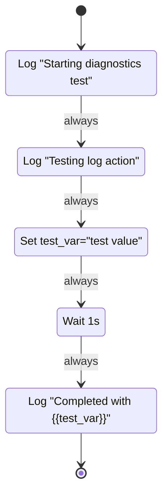

# Test Diagnostics Actions Workflow

This workflow tests diagnostics tracking for different action types.

```mermaid
stateDiagram-v2
    [*] --> start
    start --> log_action: always
    log_action --> set_var: always
    set_var --> wait_action: always
    wait_action --> end: always
    end --> [*]

    start: Log "Starting diagnostics test"
    log_action: Log "Testing log action"
    set_var: Set test_var="test value"
    wait_action: Wait 1s
    end: Log "Completed with {{test_var}}"
```