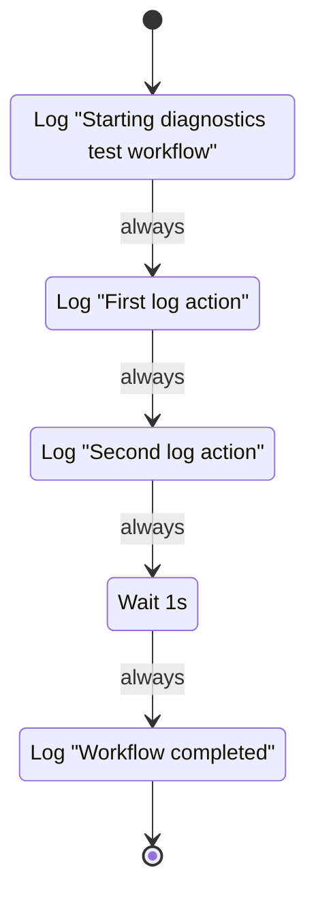

# Test Diagnostics Simple Workflow

This workflow tests the new diagnostics features with simple actions.

```mermaid
stateDiagram-v2
    [*] --> start
    start --> log1: always
    log1 --> log2: always
    log2 --> wait_action: always
    wait_action --> end: always
    end --> [*]

    start: Log "Starting diagnostics test workflow"
    log1: Log "First log action"
    log2: Log "Second log action"
    wait_action: Wait 1s
    end: Log "Workflow completed"
```