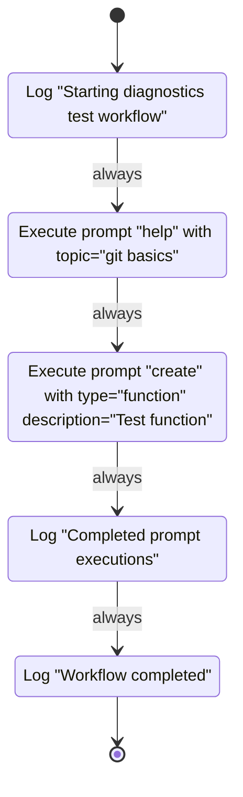

# Test Diagnostics Workflow

This workflow tests the new diagnostics features by executing multiple prompts and actions.

```mermaid
stateDiagram-v2
    [*] --> start
    start --> first_prompt: always
    first_prompt --> second_prompt: always
    second_prompt --> log_results: always
    log_results --> end: always
    end --> [*]

    start: Log "Starting diagnostics test workflow"
    first_prompt: Execute prompt "help" with topic="git basics"
    second_prompt: Execute prompt "create" with type="function" description="Test function"
    log_results: Log "Completed prompt executions"
    end: Log "Workflow completed"
```