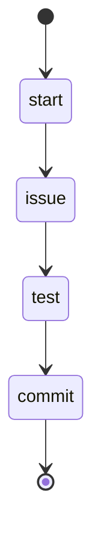

## States

## Actions

- start: log "Coding an issue"
- issue: execute prompt "issue/code"
- test: run workflow "tdd"
- commit: execute prompt "commit"

## Description

This workflow works an issue until it is coded and tested.
