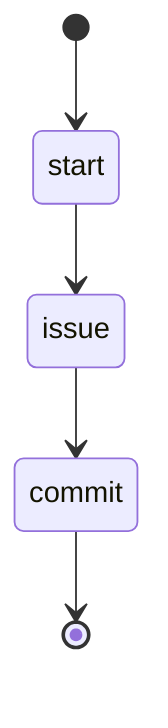

## States

```mermaid
stateDiagram-v2
    [*] --> start
    start --> issue
    issue --> commit
    commit --> [*]
```

## Actions

- start: log "Completing an issue"
- issue: execute prompt "issue/complete"
- commit: execute prompt "commit"

## Description

Marks an issue as complete.
