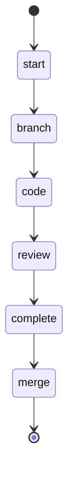

## Usage

```bash
swissarmyhammer flow run do_issue
```

## States



## Actions

- start: log "Working an issue"
- branch: execute prompt "issue/branch"
- code: run workflow "code_issue"
- review: run workflow "review_issue"
- complete: execute prompt "issue/complete"
- merge: execute prompt "merge"

## Description

This workflow works an issue until it is completely resolved, tested, and reviewed.
