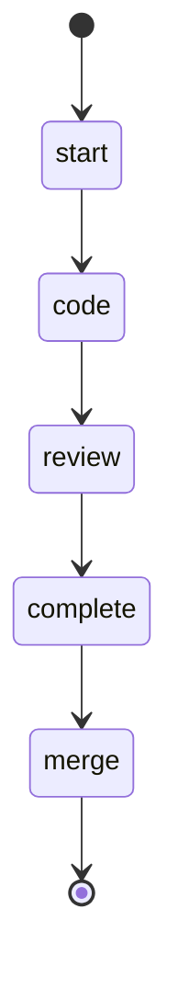

## States

## Actions

- start: log "Working an issue"
- code: run workflow "code_issue"
- review: run workflow "review_issue"
- complete: run workflow "complete_issue"
- merge: execute prompt "issue/merge"

## Description

This workflow works an issue until it is completely resolved, tested, and reviewed.
