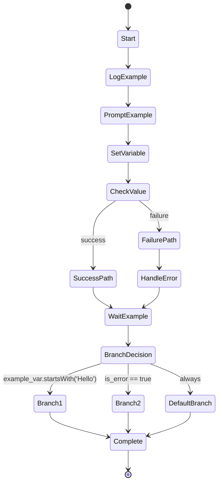

# Example Actions Workflow

This workflow demonstrates all available action types in Swiss Army Hammer workflows.



## Actions

The Actions section maps state names to their actions. Format: `- StateName: Action description`

- Start: Log "Starting example workflow"
- LogExample: Log warning "This is a warning message"
- PromptExample: Execute prompt "say-hello" with result="greeting"
- SetVariable: Set example_var="Hello from workflow"
- CheckValue: Log "Checking execution status..."
- SuccessPath: Log "Success! Taking the success branch"
- FailurePath: Log error "Failure detected, handling error"
- HandleError: Log "Error has been handled"
- WaitExample: Wait 2 seconds
- BranchDecision: Set branch_value="${example_var}"
- Branch1: Log "Branch 1 selected: ${branch_value} contains Hello"
- Branch2: Log "Branch 2 selected: ${branch_value} is error state"
- DefaultBranch: Log "Default branch selected"
- Complete: Log "Workflow complete! Greeting was: ${greeting}"

## Action Reference

### Execute Prompt
- Basic: `Execute prompt "prompt-name"`
- With result: `Execute prompt "prompt-name" with result="variable_name"`
- With arguments: `Execute prompt "prompt-name" with arg1="value1" arg2="value2"`
- Case insensitive: `execute prompt` also works

### Log Messages
- Info: `Log "message"`
- Warning: `Log warning "message"`
- Error: `Log error "message"`

### Set Variables
- `Set variable_name="value"`
- Variables can be used later with `${variable_name}` syntax

### Wait
- `Wait N seconds` (or second, minutes, minute, hours, hour)
- `Wait for user input` (waits for Enter key)

### Run Sub-workflow
- `Run workflow "workflow-name"`
- `Delegate to "workflow-name"` (same as run workflow)

## Claude Result Variables

When actions complete, Swiss Army Hammer automatically sets variables based on the Claude API response:

### Standard Variables (All Actions)
- `result`: The result content from the action
- `success`: Boolean indicating if the action succeeded
- `failure`: Boolean indicating if the action failed

### Claude API Response Variables (Prompt Actions)
- `is_error`: Boolean from Claude API indicating if there was an error
- `duration_ms`: Total execution time in milliseconds
- `duration_api_ms`: Claude API call time in milliseconds
- `num_turns`: Number of conversation turns
- `total_cost_usd`: Cost of the Claude API call
- `session_id`: Claude session identifier

### Using Variables in CEL Expressions

You can use any of these variables in transition conditions:

```yaml
# Branch on Claude API errors
MyState --> ErrorBranch: is_error == true

# Branch on execution success
MyState --> SuccessBranch: success == true

# Branch on cost thresholds
MyState --> CostAlert: total_cost_usd > 0.10
```

## Branching and Conditional Transitions

This workflow demonstrates branching with the following conditional transitions:

### Success/Failure Branching (CheckValue State)
- **OnSuccess**: Transitions to `SuccessPath` when the previous action succeeds
- **OnFailure**: Transitions to `FailurePath` when the previous action fails

### Choice State Branching (BranchDecision State)
The `BranchDecision` state is a choice state that evaluates conditions to determine the next state:
- **Branch1**: Selected when `example_var` starts with "Hello" (CEL: `example_var.startsWith('Hello')`)
- **Branch2**: Selected when there is an error (CEL: `is_error == true`)
- **DefaultBranch**: Selected when no other conditions match

### Transition Conditions
Transitions between states can have different condition types:
- `always`: Unconditional transition (default)
- `on_success`: Transition only on successful execution
- `on_failure`: Transition only on failed execution
- `custom`: Custom expression evaluation