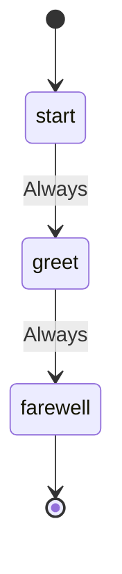

# Greeting Workflow

This workflow demonstrates how to use `--set` variables with liquid templates in action strings.

## Usage

```bash
swissarmyhammer flow run greeting --set name=John --set language=English
```

## States



## Actions

- start: Log "Starting greeting workflow"
- greet: Execute prompt "say-hello" with name="{{ name }}" language="{{ language | default: 'English' }}"
- farewell: Log "Goodbye, {{ name }}!"

## Description

This workflow showcases the use of liquid template variables in action strings:

1. **Start State**: Logs a simple message
2. **Greet State**: Executes a prompt with template variables passed via `--set`
   - `{{ name }}` - The name to greet (required)
   - `{{ language | default: 'English' }}` - The language to use (defaults to English)
3. **Farewell State**: Logs a goodbye message using the name template variable

The template variables are rendered before the action is parsed, allowing dynamic customization of workflow behavior at runtime.