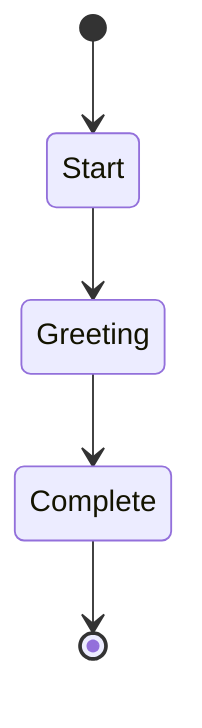

# Hello World Workflow

This is a simple workflow that demonstrates basic workflow functionality.
It starts, greets the user, and then completes.



## Actions

- Start: Initialize workflow
- Greeting: Execute prompt "say-hello" with result="greeting_output"
- Complete: Log "Workflow completed! Greeting result: ${greeting_output}"

## Description

This workflow demonstrates:

- Basic state transitions
- Simple logging actions
- A complete workflow lifecycle from start to finish

## Usage

To run this workflow:

```bash
swissarmyhammer flow run hello-world
```