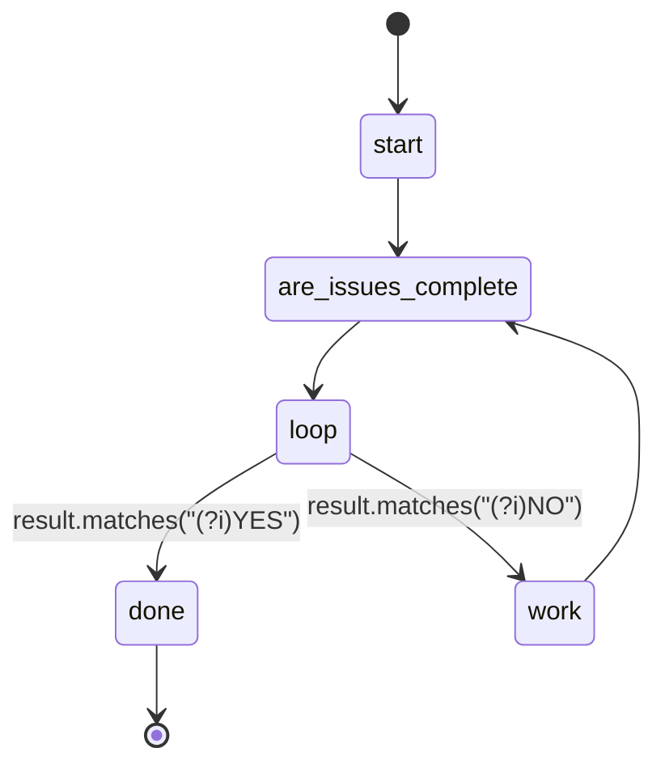

## States

## Actions

- start: log "Resolving issues"
- are_issues_complete: execute prompt "are_issues_complete"
- work: run workflow "do_issue"
- done: log "Complete"

## Description

This workflow works on tests until they all pass.
