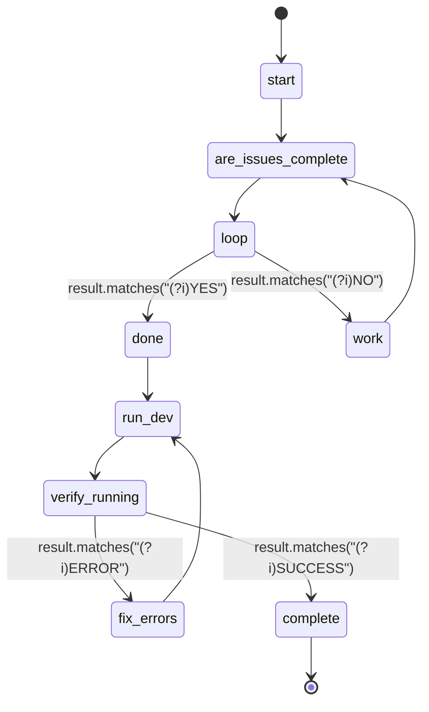

## States

## Actions

- start: log "Resolving issues"
- are_issues_complete: execute prompt "are_issues_complete"
- work: run workflow "do_issue"
- done: log "All issues complete, preparing to run development environment"
- run_dev: execute prompt "run_dev_environment"
- verify_running: execute prompt "verify_dev_running"
- fix_errors: execute prompt "fix_dev_errors"
- complete: log "Development environment is running successfully"

## Description

This workflow works on issues until they all pass, then attempts to run the development environment.
It will retry if errors occur during startup.