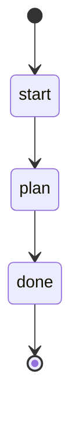

## States

```mermaid
stateDiagram-v2
    [*] --> start
    start --> plan
    plan --> done
    done --> [*]
```

## Actions

- start: log "Making the plan"
- plan: execute prompt "plan"
- done: log "Plan ready, look in ./issues"

## Description

This workflow works on tests until they all pass.
