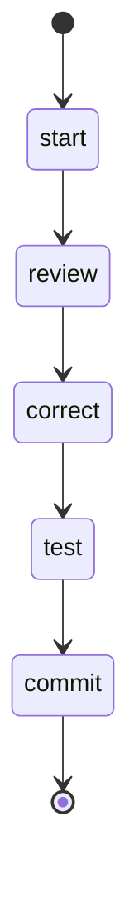

## States

## Actions

- start: log "Reviewing an issue"
- review: execute prompt "review/branch"
- correct: execute prompt "code/review"
- test: run workflow "tdd"
- commit: execute prompt "commit"

## Description

This workflow reviews a working branch and then implements that review.
