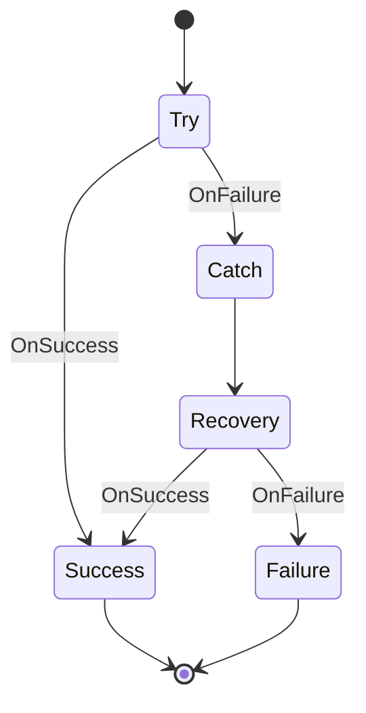

# Error Handling Workflow

This workflow demonstrates robust error handling with try/catch patterns and recovery mechanisms.

## States

### Try
- **Type**: Action
- **Description**: Attempts the primary operation
- **Actions**: Execute risky operation with error handling
- **Transitions**: 
  - OnSuccess -> Success
  - OnFailure -> Catch

### Catch
- **Type**: Action
- **Description**: Handles errors from the Try state
- **Actions**: Log error, analyze failure, prepare recovery
- **Transitions**: Always moves to Recovery

### Recovery
- **Type**: Action
- **Description**: Attempts to recover from the error
- **Actions**: Clean up resources, reset state, attempt fallback
- **Transitions**: 
  - OnSuccess -> Success
  - OnFailure -> Failure

### Success
- **Type**: Final
- **Description**: Successful completion (either direct or after recovery)
- **Actions**: Log success, finalize results

### Failure
- **Type**: Final
- **Description**: Unrecoverable failure
- **Actions**: Log failure, alert operators, cleanup

## Workflow Definition

## Usage

Use this workflow pattern for operations that:
- May fail due to external dependencies
- Can be retried or have fallback options
- Need graceful degradation

## Variables

- `attempt_count`: Number of attempts made
- `last_error`: Details of the most recent error
- `recovery_strategy`: The recovery method being used
- `max_retries`: Maximum number of recovery attempts