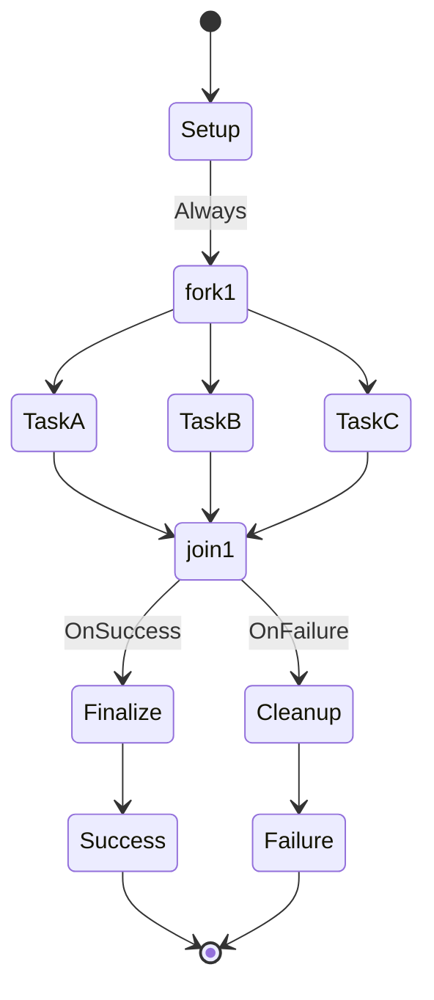

# Parallel Workflow

This workflow demonstrates parallel execution using fork-join patterns for concurrent processing.

## States

### Setup
- **Type**: Action
- **Description**: Prepares data for parallel processing
- **Actions**: 
  - Validate inputs
  - Prepare shared resources
  - Initialize parallel contexts
- **Transitions**: Always moves to fork1

### fork1
- **Type**: Fork
- **Description**: Splits execution into parallel branches
- **Actions**: Create parallel execution contexts
- **Transitions**: 
  - Parallel -> TaskA
  - Parallel -> TaskB
  - Parallel -> TaskC

### TaskA
- **Type**: Action
- **Description**: First parallel task
- **Actions**: Execute independent task A
- **Transitions**: Always moves to join1

### TaskB
- **Type**: Action
- **Description**: Second parallel task
- **Actions**: Execute independent task B
- **Transitions**: Always moves to join1

### TaskC
- **Type**: Action
- **Description**: Third parallel task
- **Actions**: Execute independent task C
- **Transitions**: Always moves to join1

### join1
- **Type**: Join
- **Description**: Waits for all parallel tasks to complete
- **Actions**: 
  - Wait for TaskA, TaskB, TaskC completion
  - Collect results from all branches
  - Merge results
- **Transitions**: 
  - OnSuccess -> Finalize
  - OnFailure -> Cleanup

### Finalize
- **Type**: Action
- **Description**: Final processing of merged results
- **Actions**: Process combined results
- **Transitions**: Always moves to Success

### Cleanup
- **Type**: Action
- **Description**: Cleanup after partial failure
- **Actions**: Clean up resources from failed parallel tasks
- **Transitions**: Always moves to Failure

### Success
- **Type**: Final
- **Description**: All parallel tasks completed successfully
- **Actions**: Log success and final results

### Failure
- **Type**: Final
- **Description**: One or more parallel tasks failed
- **Actions**: Log failure details

## Workflow Definition

## Usage

Use this workflow pattern for:
- Independent data processing tasks
- Parallel file operations
- Multiple API calls that can run concurrently
- Batch processing with parallel workers

## Variables

- `task_a_result`: Result from TaskA
- `task_b_result`: Result from TaskB
- `task_c_result`: Result from TaskC
- `merged_result`: Combined results from all tasks
- `parallel_timeout`: Maximum time to wait for parallel tasks
- `failed_tasks`: List of tasks that failed