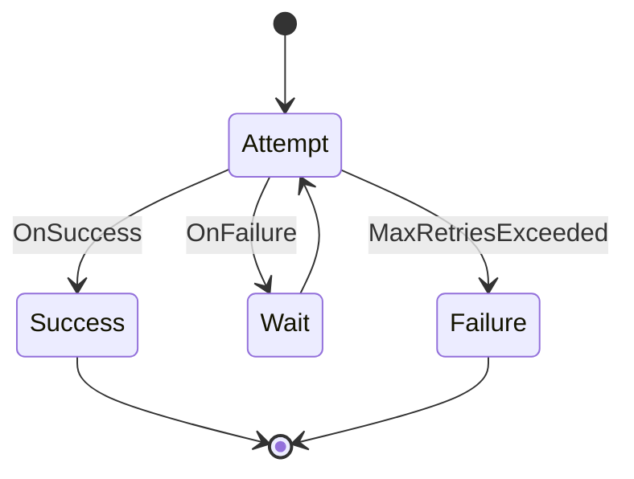

# Retry Workflow

This workflow demonstrates retry logic with exponential backoff for handling transient failures.

## States

### Attempt
- **Type**: Action
- **Description**: Makes an attempt to execute the operation
- **Actions**: 
  - Execute the operation
  - Increment attempt counter
  - Record attempt timestamp
- **Transitions**: 
  - OnSuccess -> Success
  - OnFailure -> Wait (if retries remaining)
  - OnFailure -> Failure (if no retries remaining)

### Wait
- **Type**: Action
- **Description**: Waits before retrying with exponential backoff
- **Actions**: 
  - Calculate wait time: base_delay * (2 ^ attempt_count)
  - Sleep for calculated duration
  - Log retry attempt
- **Transitions**: Always moves to Attempt

### Success
- **Type**: Final
- **Description**: Operation completed successfully
- **Actions**: Log success with attempt count

### Failure
- **Type**: Final
- **Description**: All retry attempts exhausted
- **Actions**: Log final failure with total attempts

## Workflow Definition

## Usage

Use this workflow pattern for:
- Network operations that may fail temporarily
- Database operations with connection issues
- API calls to external services
- File operations that may be temporarily locked

## Variables

- `max_retries`: Maximum number of retry attempts (default: 3)
- `base_delay`: Base delay in milliseconds (default: 1000)
- `attempt_count`: Current attempt number (starts at 0)
- `last_error`: Error from the most recent attempt
- `start_time`: When the workflow started
- `total_delay`: Total time spent waiting