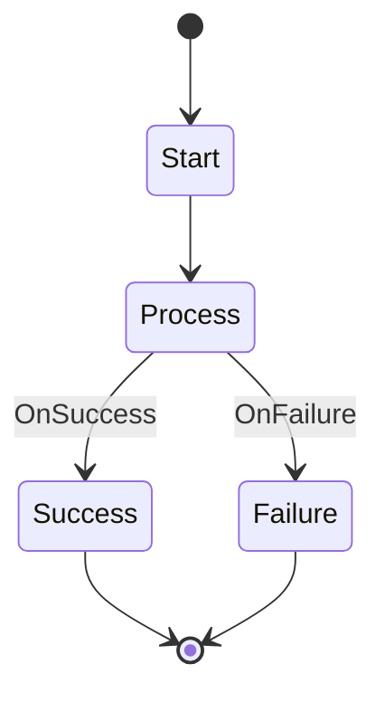

# Simple Workflow

This workflow demonstrates a basic success/failure pattern.

## States

### Start
- **Type**: Initial
- **Description**: Entry point for the workflow
- **Actions**: Initialize basic variables
- **Transitions**: Always moves to Process

### Process
- **Type**: Action
- **Description**: Main processing logic
- **Actions**: Execute the core workflow logic
- **Transitions**: 
  - OnSuccess -> Success
  - OnFailure -> Failure

### Success
- **Type**: Final
- **Description**: Successful completion
- **Actions**: Log success and cleanup

### Failure
- **Type**: Final
- **Description**: Failed completion
- **Actions**: Log failure and cleanup

## Workflow Definition

## Usage

This workflow can be used as a template for any process that has a clear success/failure outcome.

## Variables

- `start_time`: Timestamp when workflow started
- `result`: Final result of the process
- `error_message`: Error details if process fails