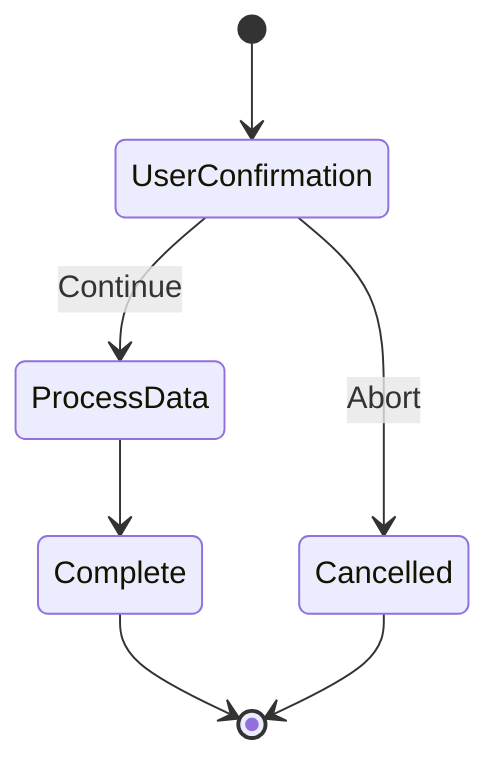

# User Confirmation Workflow

This workflow demonstrates user interaction patterns requiring confirmation before proceeding with operations.

## States

### UserConfirmation
- **Type**: UserInteraction
- **Description**: Presents information to user and waits for confirmation
- **Actions**: 
  - Display operation details
  - Show potential impacts
  - Wait for user response
- **Transitions**: 
  - Continue -> ProcessData
  - Abort -> Cancelled

### ProcessData
- **Type**: Action
- **Description**: Processes data after user confirmation
- **Actions**: 
  - Execute the confirmed operation
  - Log the action
  - Update system state
- **Transitions**: Always moves to Complete

### Complete
- **Type**: Final
- **Description**: Operation completed successfully
- **Actions**: 
  - Log completion
  - Send confirmation to user
  - Update audit trail

### Cancelled
- **Type**: Final
- **Description**: Operation cancelled by user
- **Actions**: 
  - Log cancellation
  - Clean up any prepared resources
  - Notify user of cancellation

## Workflow Definition

## Usage

Use this workflow pattern for:
- Destructive operations (delete, modify critical data)
- Operations with significant cost implications
- System configuration changes
- Batch operations affecting multiple records

## Variables

- `operation_description`: Description of the operation to confirm
- `user_response`: User's confirmation response
- `confirmation_timeout`: Maximum time to wait for user response
- `operation_details`: Detailed information about the operation
- `impact_summary`: Summary of potential impacts