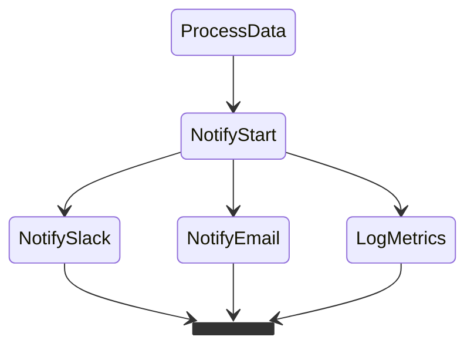
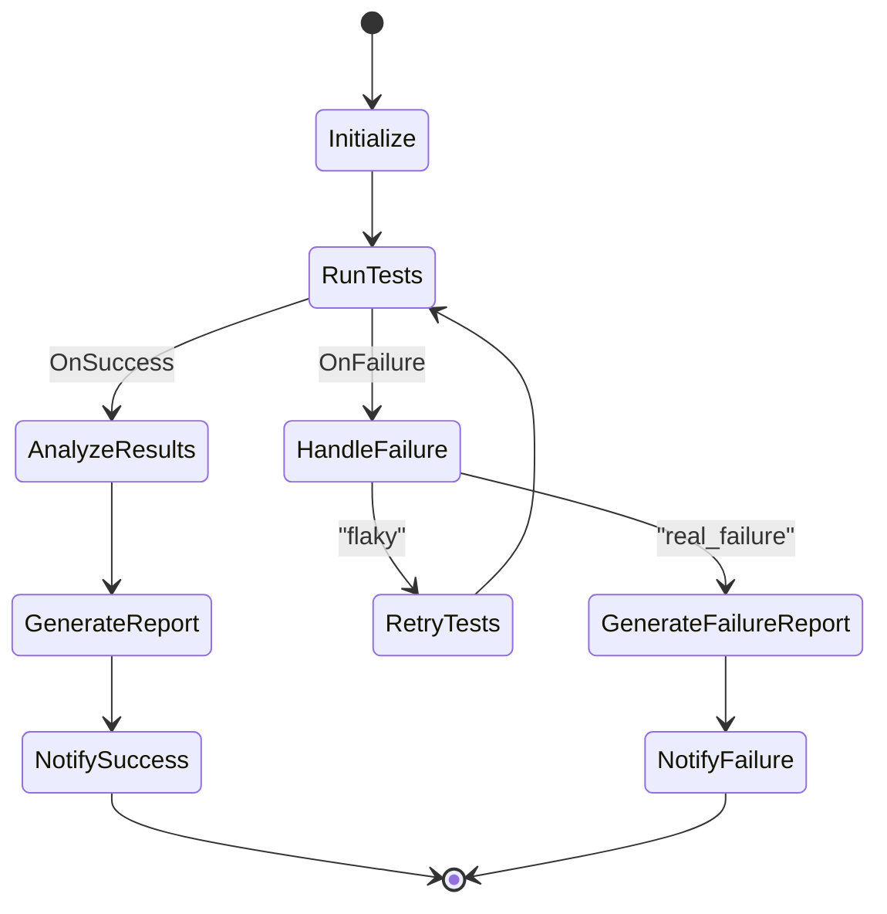

# Workflow Examples

This guide showcases practical workflow examples demonstrating various features and patterns available in SwissArmyHammer's workflow system.

## Example Workflows

Example workflows are located in both:
- `workflows/builtin/` - Basic example workflows
- `prompts/builtin/workflows/` - Advanced workflow patterns

All workflows can be run directly or used as templates for your own workflows.

### Basic Examples

#### Hello World Workflow

**File**: `workflows/builtin/hello-world.md`  
**Type**: Simple linear workflow

The simplest possible workflow demonstrating basic functionality:

```bash
swissarmyhammer flow run hello-world
```

**Features demonstrated**:
- Basic state transitions
- Prompt execution with result capture
- Using variables in log messages

#### Example Actions Workflow

**File**: `workflows/builtin/example-actions.md`  
**Type**: Action reference workflow

Demonstrates all available workflow actions:

```bash
swissarmyhammer flow run example-actions
```

**Features demonstrated**:
- All action types (Log, Execute prompt, Set variable, Wait)
- Different log levels (info, warning, error)
- Variable substitution
- Sub-workflow execution

### 1. Code Review Workflow

**File**: `prompts/builtin/workflows/code-review.md`  
**Type**: Linear workflow

A straightforward sequential workflow for automated code review:

```bash
swissarmyhammer flow run code-review --var code_path=src/main
```

**Features demonstrated**:
- Linear state progression
- State variables
- Conditional transitions based on quality checks
- Feedback loops for addressing issues

**Use cases**:
- Automated code quality checks
- Pre-commit validations
- Continuous integration pipelines

### 2. Deployment Pipeline

**File**: `prompts/builtin/workflows/deployment-pipeline.md`  
**Type**: Interactive workflow with choices

An interactive deployment workflow with environment selection and rollback options:

```bash
swissarmyhammer flow run deployment-pipeline --var app_name=myservice
```

**Features demonstrated**:
- User choice actions for environment selection
- Conditional transitions based on build/test results
- Rollback mechanisms
- Different deployment paths for different environments
- Auto-rollback configuration

**Use cases**:
- Application deployments
- Infrastructure provisioning
- Release management

### 3. Data Processing Pipeline

**File**: `prompts/builtin/workflows/data-processing-pipeline.md`  
**Type**: Parallel execution workflow

A high-performance data processing workflow that handles multiple data sources concurrently:

```bash
swissarmyhammer flow run data-processing-pipeline \
  --var data_sources=logs,metrics,events
```

**Features demonstrated**:
- Parallel state execution
- Synchronization points with `wait_for_parallel`
- Parallel actions within states
- Timeout management for long-running tasks
- Aggregation of parallel results

**Use cases**:
- ETL pipelines
- Data analysis workflows
- Batch processing systems
- Report generation

### 4. Database Migration

**File**: `prompts/builtin/workflows/database-migration.md`  
**Type**: Error handling workflow

A robust database migration workflow with comprehensive error handling:

```bash
swissarmyhammer flow run database-migration --var target_version=v2.0
```

**Features demonstrated**:
- Multiple error states for different failure types
- Retry logic with configurable attempts
- Multi-level rollback (migration rollback, backup restore)
- Emergency mode for critical failures
- Validation at every step
- Graceful degradation

**Use cases**:
- Database schema updates
- Data migrations
- System upgrades
- Critical operations requiring rollback capability

### 5. Multi-Step Refactoring

**File**: `prompts/builtin/workflows/multi-step-refactoring.md`  
**Type**: Nested workflow orchestration

A complex refactoring workflow that coordinates multiple sub-workflows:

```bash
swissarmyhammer flow run multi-step-refactoring \
  --var project_path=src/core \
  --var refactoring_scope=full
```

**Features demonstrated**:
- Single workflow execution with `run_workflow`
- Sequential workflow execution
- Parallel workflow execution
- Conditional workflow execution
- Data passing between workflows
- Complex orchestration patterns

**Use cases**:
- Large-scale refactoring projects
- Multi-phase deployments
- Complex automation pipelines
- Orchestrating microservices

## Running Example Workflows

### Basic Execution

Run any example workflow:

```bash
swissarmyhammer flow run <workflow-name>
```

### With Custom Variables

Override default variables:

```bash
swissarmyhammer flow run code-review \
  --var code_path=lib/ \
  --var review_depth=security-focused
```

### Resume from Failure

If a workflow fails, you can resume from where it left off:

```bash
swissarmyhammer flow run database-migration --resume <run_id>
```

### List Available Workflows

See all available workflows:

```bash
swissarmyhammer flow list
```

## Learning from Examples

### How to Study the Examples

1. **Read the workflow definition**: Understand the state flow and transitions
2. **Examine the actions**: See how different action types are used
3. **Look at error handling**: Note how errors are caught and handled
4. **Study variable usage**: See how data flows through the workflow
5. **Run with debugging**: Use `--debug` to see detailed execution logs

### Adapting Examples

To create your own workflow based on an example:

1. Copy the example workflow to your prompts directory
2. Modify the metadata (name, description, tags)
3. Adjust the state diagram to match your needs
4. Update actions and variables
5. Test incrementally with `--dry-run`

### Common Modifications

**Adding error handling** to the code review workflow:

```markdown
## Actions

- AnalyzeCode: Execute prompt "analyze-codebase" with path="${code_path}"
- HandleError: Log error "Code analysis failed: ${error}"
- Continue: Log "Continuing with partial results"
```

And add retry logic in the Mermaid diagram:

```mermaid
AnalyzeCode --> HandleError: OnFailure
HandleError --> RetryWait
RetryWait --> AnalyzeCode
```

**Making deployment pipeline fully automated**:

Pass variables when running the workflow:

```bash
swissarmyhammer flow run deployment-pipeline \
  --var auto_deploy=true \
  --var target_env=staging \
  --var skip_confirmations=true
```

**Adding notifications** to data processing:

```markdown
## Actions

- PublishResults: Execute prompt "send-notification" with channel="#data-team" message="Pipeline completed: ${result_count} records processed"
```

Or for multiple notifications:



## Best Practices from Examples

### 1. State Naming
- Use descriptive, action-oriented names
- Keep names concise but clear
- Use consistent naming patterns

### 2. Error Handling
- Always include error states for critical operations
- Provide meaningful error messages
- Design rollback paths for reversible operations

### 3. Variable Management
- Define sensible defaults
- Document variable purposes
- Validate inputs early in the workflow

### 4. User Interaction
- Provide clear choice descriptions
- Include help text for complex decisions
- Allow bypassing interaction for automation

### 5. Performance
- Use parallel execution where possible
- Set appropriate timeouts
- Design for idempotency

## Complete Workflow Example

Here's a complete workflow file showing all the components:

```markdown
---
name: automated-testing
title: Automated Testing Workflow
description: Runs tests, analyzes results, and generates reports
category: user
tags:
  - testing
  - ci
  - automation
---

# Automated Testing Workflow

This workflow runs the test suite, analyzes failures, and generates comprehensive reports.



## Actions

- Initialize: Log "Starting test run for ${branch_name}"
- RunTests: Execute prompt "run-test-suite" with suite="${test_suite}" parallel="${parallel_tests}"
- AnalyzeResults: Execute prompt "analyze-test-results" with results="${output}"
- HandleFailure: Execute prompt "categorize-failures" with failures="${error}"
- RetryTests: Wait 30 seconds
- GenerateReport: Execute prompt "generate-test-report" with data="${output}" format="html"
- GenerateFailureReport: Execute prompt "generate-failure-report" with failures="${output}"
- NotifySuccess: Execute prompt "send-notification" with status="success" message="All tests passed!"
- NotifyFailure: Execute prompt "send-notification" with status="failure" message="Tests failed: ${error}"
```

## Troubleshooting Examples

### Common Issues

1. **Workflow not found**:
   ```bash
   swissarmyhammer flow list  # Check available workflows
   ```

2. **Variable errors**:
   ```bash
   swissarmyhammer flow show code-review  # View workflow details
   ```

3. **State transition failures**:
   - Check condition syntax
   - Verify variable values
   - Use `--debug` for detailed logs

4. **Action failures**:
   - Ensure referenced prompts exist
   - Check variable interpolation
   - Verify action syntax

### Debugging Tips

1. Use verbose output:
   ```bash
   swissarmyhammer workflow run deployment-pipeline -v
   ```

2. Enable debug mode:
   ```bash
   swissarmyhammer workflow run data-processing-pipeline --debug
   ```

3. Test with minimal data:
   ```bash
   swissarmyhammer workflow run data-processing-pipeline \
     --set data_sources=logs \
     --set processing_mode=sequential
   ```

## Next Steps

- Explore [Workflow Patterns](./workflow-patterns.md) for advanced techniques
- Read the main [Workflows Documentation](./workflows.md) for detailed reference
- Create your own workflows based on these examples
- Share your workflows with the community