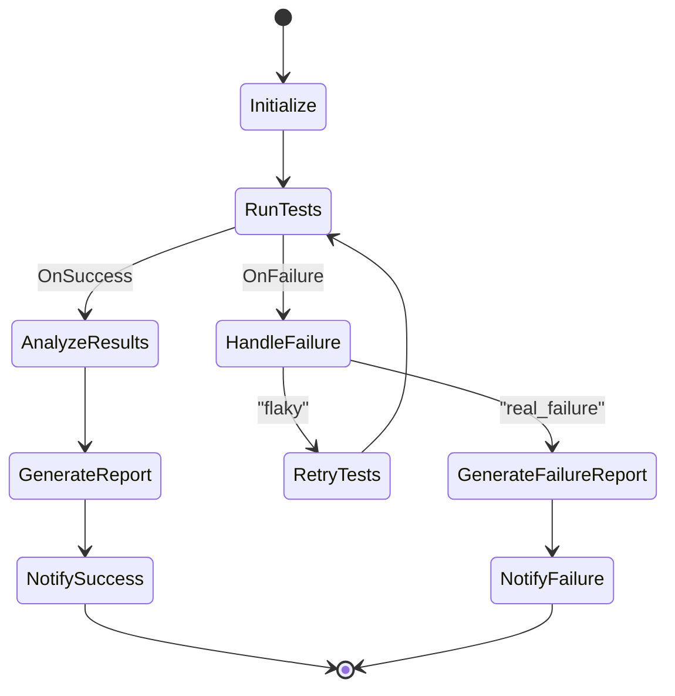

# Workflow Examples

This guide showcases practical workflow examples demonstrating various features and patterns available in SwissArmyHammer's workflow system.

## Example Workflows

Example workflows are located in:
- `builtin/workflows/` - Example workflows demonstrating various features and patterns

All workflows can be run directly or used as templates for your own workflows.

### Basic Examples

#### Hello World Workflow

**File**: `builtin/workflows/hello-world.md`  
**Type**: Simple linear workflow

The simplest possible workflow demonstrating basic functionality:

```bash
swissarmyhammer flow run hello-world
```

**Features demonstrated**:
- Basic state transitions
- Prompt execution with result capture
- Using variables in log messages

#### Example Actions Workflow

**File**: `builtin/workflows/example-actions.md`  
**Type**: Action reference workflow

Demonstrates all available workflow actions:

```bash
swissarmyhammer flow run example-actions
```

**Features demonstrated**:
- All action types (Log, Execute prompt, Set variable, Wait)
- Different log levels (info, warning, error)
- Variable substitution
- Sub-workflow execution

### Greeting Workflow

**File**: `builtin/workflows/greeting.md`  
**Type**: Template variable demonstration

A simple workflow that demonstrates using template variables in workflows:

```bash
swissarmyhammer flow run greeting --set name=John --set language=English
```

**Features demonstrated**:
- Template variables with `--set` parameters
- Variable defaults with liquid templates
- Linear state progression
- Prompt execution with variable substitution

**Use cases**:
- Learning template variable usage
- Building parameterized workflows
- Dynamic workflow customization

## Running Example Workflows

### Basic Execution

Run any example workflow:

```bash
swissarmyhammer flow run <workflow-name>
```

### With Custom Variables

Customize workflows with variables:

```bash
swissarmyhammer flow run greeting \
  --set name="Your Name" \
  --set language="French"
```

### Resume from Failure

If a workflow fails, you can resume from where it left off:

```bash
swissarmyhammer flow run example-actions --resume <run_id>
```

### List Available Workflows

See all available workflows:

```bash
swissarmyhammer flow list
```

## Learning from Examples

### How to Study the Examples

1. **Read the workflow definition**: Understand the state flow and transitions
2. **Examine the actions**: See how different action types are used
3. **Look at error handling**: Note how errors are caught and handled
4. **Study variable usage**: See how data flows through the workflow
5. **Run with debugging**: Use `--debug` to see detailed execution logs

### Adapting Examples

To create your own workflow based on an example:

1. Copy the example workflow to your prompts directory
2. Modify the metadata (name, description, tags)
3. Adjust the state diagram to match your needs
4. Update actions and variables
5. Test incrementally with `--dry-run`

### Common Modifications

**Adding error handling** to workflows:

```markdown
## Actions

- ProcessData: Execute prompt "process-data" with path="${data_path}"
- HandleError: Log error "Data processing failed: ${error}"
- Retry: Log "Retrying with different parameters"
```

And add retry logic in the Mermaid diagram:

```mermaid
ProcessData --> HandleError: OnFailure
HandleError --> Retry
Retry --> ProcessData
```

**Adding template variables** to customize workflows:

Pass variables when running any workflow:

```bash
swissarmyhammer flow run greeting \
  --set name="Your Name" \
  --set language="French"
```

**Adding notifications** to workflows:

```markdown
## Actions

- CompleteTask: Log "Task completed successfully"
- NotifyUser: Execute prompt "send-notification" with message="Workflow completed: ${result}"
```

## Best Practices from Examples

### 1. State Naming
- Use descriptive, action-oriented names
- Keep names concise but clear
- Use consistent naming patterns

### 2. Error Handling
- Always include error states for critical operations
- Provide meaningful error messages
- Design rollback paths for reversible operations

### 3. Variable Management
- Define sensible defaults
- Document variable purposes
- Validate inputs early in the workflow

### 4. User Interaction
- Provide clear choice descriptions
- Include help text for complex decisions
- Allow bypassing interaction for automation

### 5. Performance
- Use parallel execution where possible
- Set appropriate timeouts
- Design for idempotency

## Complete Workflow Example

Here's a complete workflow file showing all the components:

```markdown
---
name: automated-testing
title: Automated Testing Workflow
description: Runs tests, analyzes results, and generates reports
category: user
tags:
  - testing
  - ci
  - automation
---

# Automated Testing Workflow

This workflow runs the test suite, analyzes failures, and generates comprehensive reports.



## Actions

- Initialize: Log "Starting test run for ${branch_name}"
- RunTests: Execute prompt "run-test-suite" with suite="${test_suite}" parallel="${parallel_tests}"
- AnalyzeResults: Execute prompt "analyze-test-results" with results="${output}"
- HandleFailure: Execute prompt "categorize-failures" with failures="${error}"
- RetryTests: Wait 30 seconds
- GenerateReport: Execute prompt "generate-test-report" with data="${output}" format="html"
- GenerateFailureReport: Execute prompt "generate-failure-report" with failures="${output}"
- NotifySuccess: Execute prompt "send-notification" with status="success" message="All tests passed!"
- NotifyFailure: Execute prompt "send-notification" with status="failure" message="Tests failed: ${error}"
```

## Troubleshooting Examples

### Common Issues

1. **Workflow not found**:
   ```bash
   swissarmyhammer flow list  # Check available workflows
   ```

2. **Variable errors**:
   ```bash
   swissarmyhammer flow show greeting  # View workflow details
   ```

3. **State transition failures**:
   - Check condition syntax
   - Verify variable values
   - Use `--debug` for detailed logs

4. **Action failures**:
   - Ensure referenced prompts exist
   - Check variable interpolation
   - Verify action syntax

### Debugging Tips

1. Use verbose output:
   ```bash
   swissarmyhammer workflow run example-actions -v
   ```

2. Enable debug mode:
   ```bash
   swissarmyhammer workflow run greeting --debug
   ```

3. Test with custom variables:
   ```bash
   swissarmyhammer workflow run greeting \
     --set name="Test User" \
     --set language="Spanish"
   ```

## Next Steps

- Explore [Workflow Patterns](./workflow-patterns.md) for advanced techniques
- Read the main [Workflows Documentation](./workflows.md) for detailed reference
- Create your own workflows based on these examples
- Share your workflows with the community