# Workflows

SwissArmyHammer provides a powerful workflow system that allows you to define and execute complex multi-step processes using Mermaid state diagrams. This guide covers creating, running, and managing workflows.

## Overview

Workflows in SwissArmyHammer are defined using Mermaid state diagrams in markdown files. Each workflow consists of states (actions) and transitions that control the flow of execution. Workflows can:

- Execute prompts or other workflows
- Make decisions based on outputs
- Run actions in parallel
- Handle errors gracefully
- Resume from failures

## Creating Workflows

Workflows are stored in `.swissarmyhammer/workflows/` directories and use the `.md` file extension. Each workflow file consists of:

1. **YAML Front Matter** - Metadata about the workflow
2. **Mermaid State Diagram** - The workflow structure
3. **Actions Section** - Mappings of states to their actions

Here's a basic workflow structure:

```markdown
---
name: my-workflow
title: My Example Workflow
description: A workflow that demonstrates basic functionality
category: user
tags:
  - example
  - automation
---

# My Example Workflow

This workflow processes data through multiple stages.

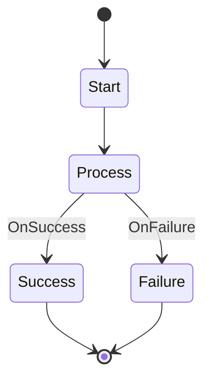

## Actions

- Start: Execute prompt "setup" with input="${data}"
- Process: Execute prompt "main-task"
- Success: Log "Task completed successfully"
- Failure: Log error "Task failed: ${error}"
```

## Workflow Components

### Front Matter

The YAML front matter contains workflow metadata:

```yaml
---
name: workflow-id           # Unique identifier for the workflow
title: Workflow Title       # Human-readable title
description: Description    # What the workflow does
category: builtin          # Category (builtin, user, etc.)
tags:                      # Tags for organization
  - automation
  - data-processing
---
```

### States

States represent steps in your workflow. They are defined in the Mermaid diagram and their actions are specified in the Actions section:

- **Execute a prompt**: `Execute prompt "prompt-name" with var="value"`
- **Run another workflow**: `Run workflow "workflow-name" with data="${input}"`
- **Set variables**: `Set result="${output}"`
- **Log messages**: `Log "Processing complete"`
- **Wait**: `Wait 5 seconds`

### Actions Section

The Actions section maps state names to their actions using the format:

```markdown
## Actions

- StateName: Action description
- AnotherState: Execute prompt "example" with param="value"
```

### Transitions

Transitions control flow between states:

- **Always**: Unconditional transition
- **OnSuccess**: Transition when action succeeds
- **OnFailure**: Transition when action fails
- **Conditional**: Based on regex matching of output

### Special States

- `[*]`: Start and end states
- Fork (`<<fork>>`) and Join (`<<join>>`): For parallel execution

## Mermaid Syntax Guide

SwissArmyHammer uses standard Mermaid state diagram syntax. The diagram defines the workflow structure, while actions are defined separately in the Actions section:

### Basic Flow

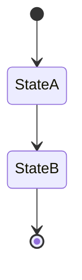

With corresponding actions:

```markdown
## Actions

- StateA: Log "Starting process"
- StateB: Execute prompt "process-data"
```

### Conditional Branching

```mermaid
stateDiagram-v2
    [*] --> Check
    Check --> OptionA: "pattern_a"
    Check --> OptionB: "pattern_b"
    Check --> Default: Always
```

### Parallel Execution

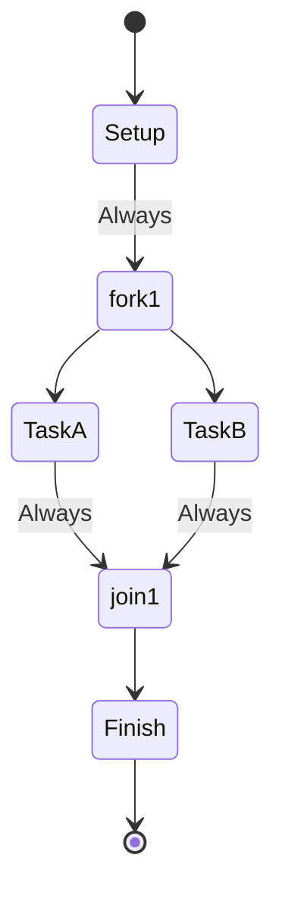

## Action Reference

### Execute Prompt

Execute a SwissArmyHammer prompt:

```
Execute prompt "prompt-name" with var1="value1" var2="${variable}"
```

### Run Workflow

Delegate to another workflow:

```
Run workflow "workflow-name" with input="${data}"
```

### Set Variable

Store values for later use:

```
Set variable_name="value"
Set result="${output}"
```

### Log Messages

Output information:

```
Log "Information message"
Log error "Error message"
Log warning "Warning message"
```

### Wait

Pause execution:

```
Wait 5 seconds
Wait 1 minute
```

### System Commands

Execute shell commands:

```
Execute command "ls -la"
Execute command "npm test"
```

## Variables and Context

Workflows have access to:

- Input variables passed via `--var`
- Variables set in previous states
- Output from executed prompts (`${output}`)
- Error messages (`${error}`)
- Workflow metadata (`${workflow_name}`, `${run_id}`)

### Variable Interpolation

Use `${variable_name}` syntax to reference variables:

```
Execute prompt "analyze" with file="${input_file}"
Set result="Analysis of ${input_file}: ${output}"
```

## Error Handling

Workflows provide robust error handling:

### Try-Catch Pattern

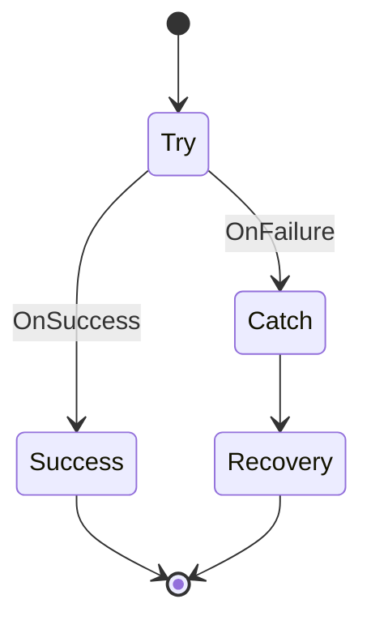

```markdown
## Actions

- Try: Execute prompt "risky-operation"
- Catch: Log error "Operation failed: ${error}"
- Recovery: Execute prompt "cleanup"
- Success: Log "Operation completed successfully"
```

### Retry Pattern

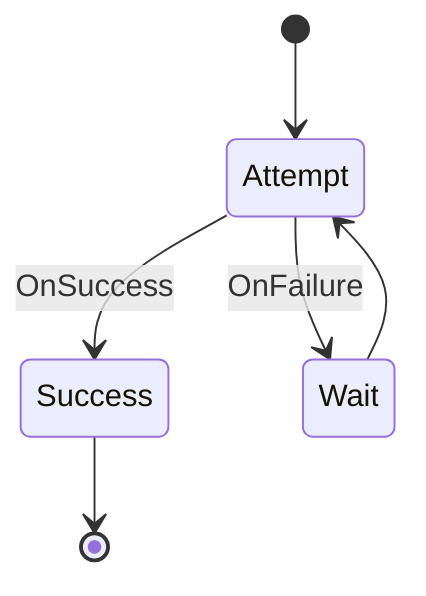

```markdown
## Actions

- Attempt: Execute prompt "network-call"
- Wait: Wait 5 seconds
- Success: Log "Network call succeeded"
```

## Best Practices

### 1. Keep States Focused

Each state should perform one clear action:

```
Good:
ValidateInput: Execute prompt "validate-json" with file="${input}"

Bad:
DoEverything: Execute prompt "validate-and-transform-and-save"
```

### 2. Use Meaningful State Names

State names should describe what happens:

```
Good: ValidateConfiguration, ProcessUserData, GenerateReport
Bad: Step1, Step2, DoStuff
```

### 3. Handle All Paths

Ensure all states have clear exit paths:

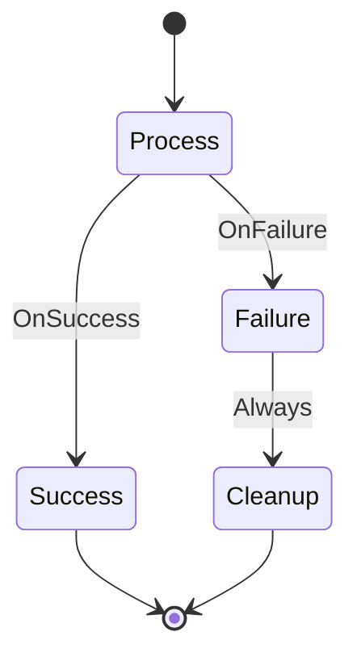

### 4. Use Variables Effectively

Pass data between states using variables:

```
ExtractData: Execute prompt "parse-file" with file="${input_file}"
ProcessData: Execute prompt "transform" with data="${output}"
SaveResults: Execute prompt "save" with content="${output}" path="${output_file}"
```

### 5. Document Complex Logic

Add comments to explain complex workflows:

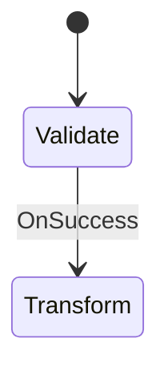

## Complete Example

Here's a complete workflow file showing all components:

```markdown
---
name: data-processor
title: Data Processing Workflow
description: Validates and processes incoming data files
category: user
tags:
  - data-processing
  - validation
  - automation
---

# Data Processing Workflow

This workflow validates incoming data files, transforms them to the required format,
and stores the results. It includes error handling and retry logic.

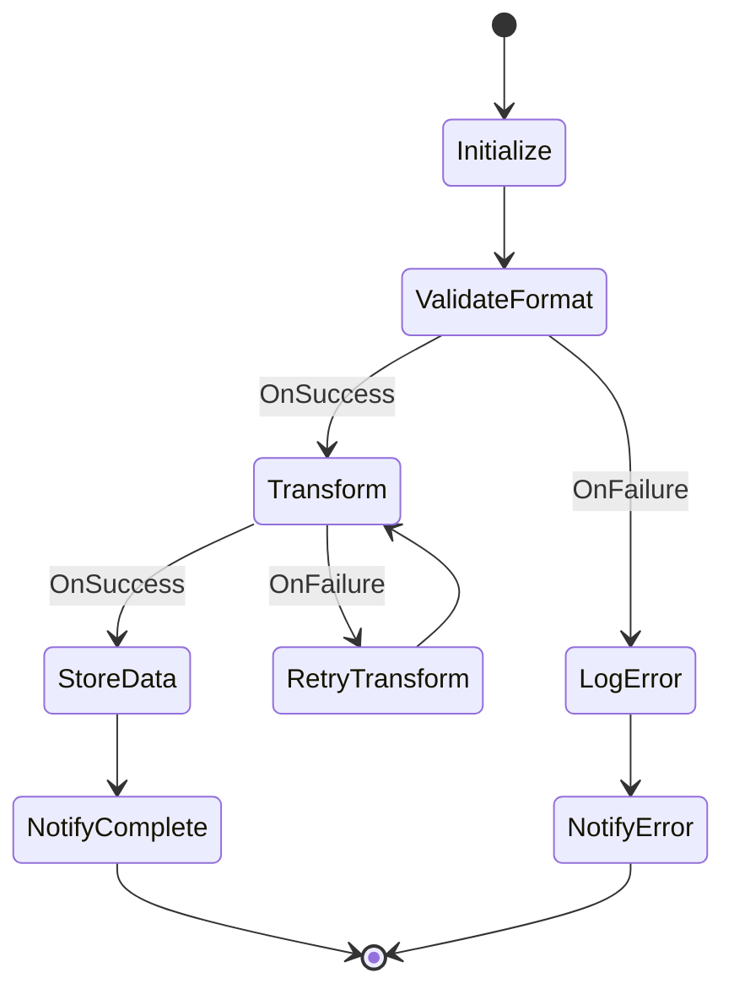

## Actions

- Initialize: Log "Starting data processing for file: ${input_file}"
- ValidateFormat: Execute prompt "validate-json-schema" with file="${input_file}" schema="${schema_file}"
- Transform: Execute prompt "transform-data" with input="${output}" format="${target_format}"
- StoreData: Execute prompt "store-to-database" with data="${output}" table="${table_name}"
- RetryTransform: Wait 5 seconds
- NotifyComplete: Log "Successfully processed ${input_file}"
- LogError: Log error "Validation failed for ${input_file}: ${error}"
- NotifyError: Execute prompt "send-notification" with message="Processing failed: ${error}" channel="alerts"
```

## Running Workflows

Execute workflows using the `flow` command:

```bash
# Run a workflow
swissarmyhammer flow run workflow-name

# Pass variables
swissarmyhammer flow run workflow-name --var input_file=data.json --var mode=production

# Resume from failure
swissarmyhammer flow run workflow-name --resume <run_id>
```

## Monitoring and Debugging

### View Workflow Runs

```bash
# List recent runs
swissarmyhammer flow list

# Show run details
swissarmyhammer flow show <run_id>
```

### Debug Output

Workflows create detailed logs in `.swissarmyhammer/workflows/runs/<run_id>.jsonl`:

- State entries and exits
- Variable values
- Prompt outputs
- Error messages
- Timing information

### Visualization

Generate workflow diagrams:

```bash
# Visualize workflow structure
swissarmyhammer flow visualize workflow-name

# Show run path
swissarmyhammer flow visualize workflow-name --run <run_id>
```

## Advanced Features

### Nested Workflows

Workflows can call other workflows, enabling modular design:

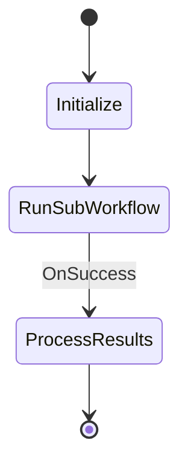

```markdown
## Actions

- Initialize: Log "Starting main workflow"
- RunSubWorkflow: Run workflow "data-processor" with input="${raw_data}"
- ProcessResults: Log "Processed ${output}"
```

### Dynamic Workflow Selection

Choose workflows at runtime:

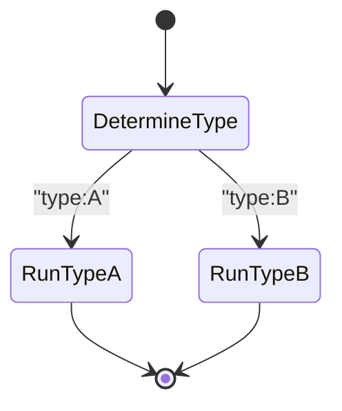

```markdown
## Actions

- DetermineType: Execute prompt "detect-type" with data="${input}"
- RunTypeA: Run workflow "process-type-a" with data="${input}"
- RunTypeB: Run workflow "process-type-b" with data="${input}"
```

### Parallel Processing

Process multiple items concurrently:

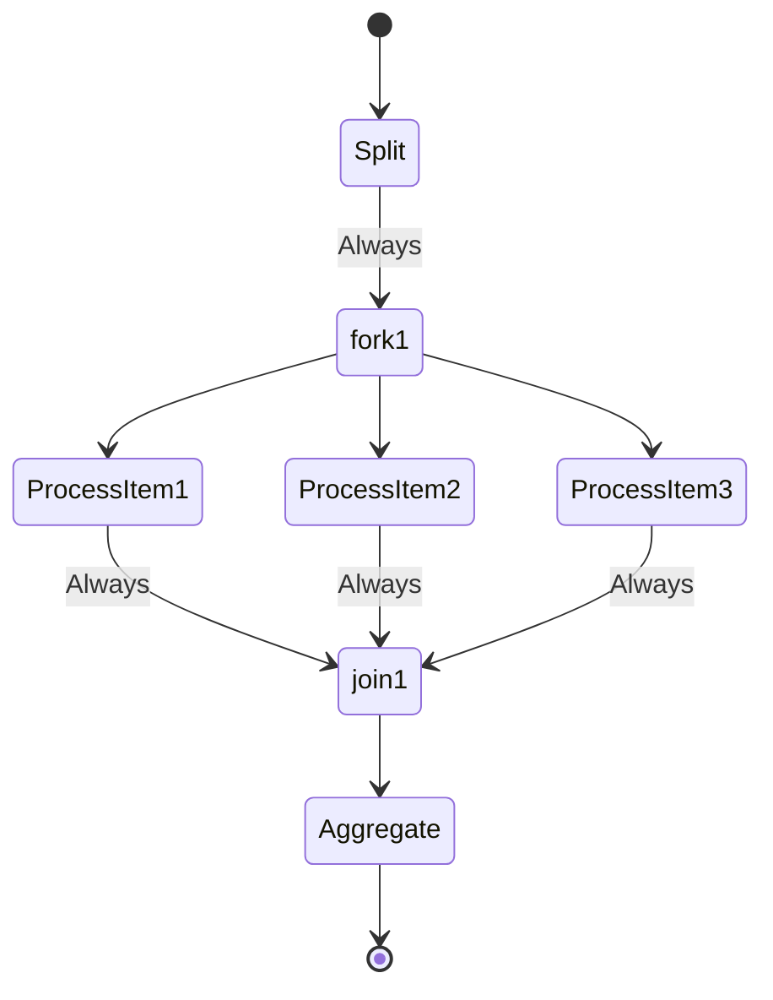

## Troubleshooting

### Common Issues

1. **Workflow not found**: Ensure workflow is in `.swissarmyhammer/workflows/`
2. **Variable undefined**: Check variable names and initialization
3. **Infinite loops**: Add proper exit conditions
4. **Prompt not found**: Verify prompt paths and names

### Validation

Always validate workflows before running:

```bash
swissarmyhammer validate
```

This checks:
- Mermaid syntax
- State connectivity
- Action syntax
- Variable usage
- Circular dependencies

## Next Steps

- Explore [Example Workflows](./workflow-examples.md) for practical patterns
- Read about [Workflow Patterns](./workflow-patterns.md) for common solutions
- Check the [CLI Reference](./cli-reference.md#flow) for all flow commands
- Learn about [Testing Workflows](./testing-guide.md#workflows)