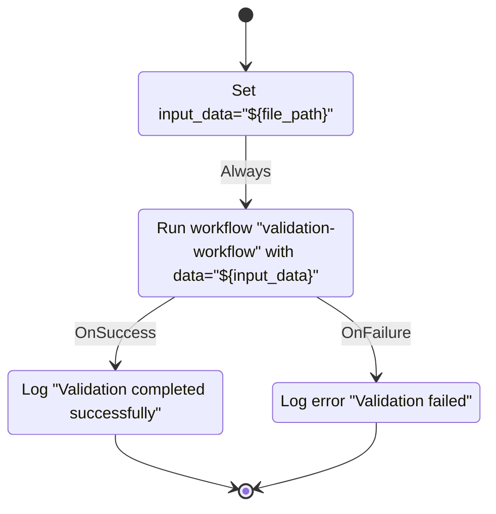
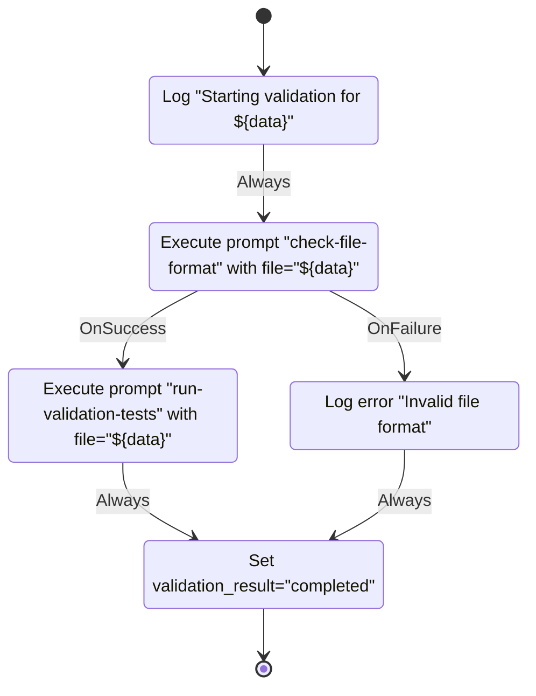
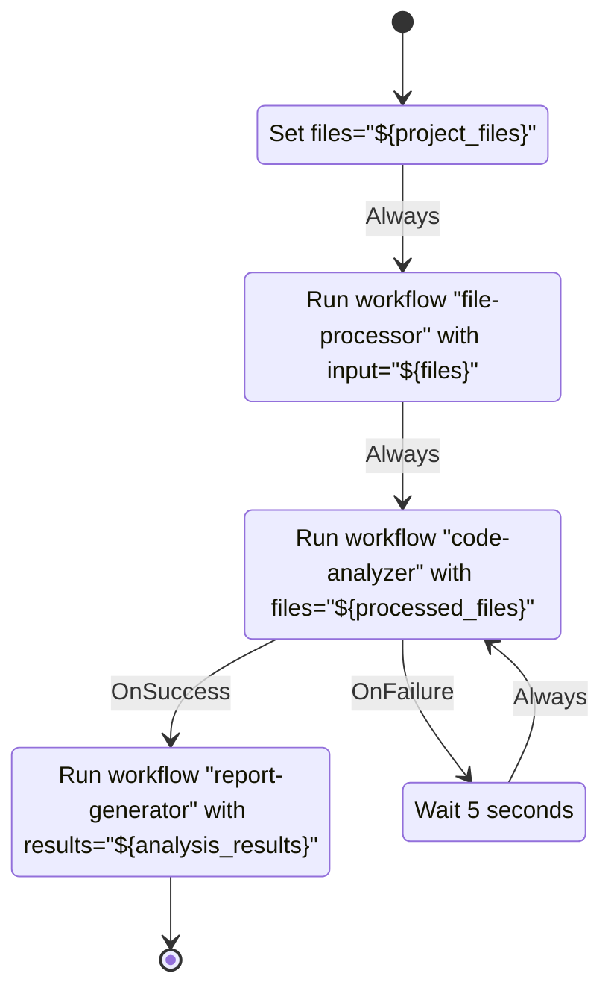

# Nested Workflow Example

This example demonstrates how to use the new workflow delegation feature in SwissArmyHammer.

## Main Workflow (main-workflow.md)

## Sub-Workflow (validation-workflow.md)

## Usage

To run this example:

1. Save the main workflow to `.swissarmyhammer/workflows/main-workflow.md`
2. Save the sub-workflow to `.swissarmyhammer/workflows/validation-workflow.md`
3. Run: `swissarmyhammer flow run main-workflow --var file_path=example.txt`

## Features Demonstrated

1. **Workflow Delegation**: The main workflow delegates to the validation workflow
2. **Variable Passing**: The `input_data` variable is passed to the sub-workflow as `data`
3. **Result Handling**: The main workflow handles success/failure from the sub-workflow
4. **Circular Dependency Protection**: If workflows try to call each other in a circle, it will be detected

## Advanced Example with Multiple Delegations

This demonstrates:
- Sequential workflow delegation
- Passing results between workflows
- Retry logic with delegated workflows