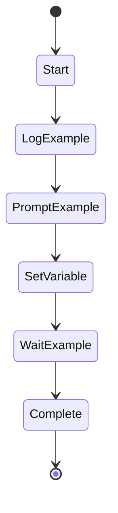

# Example Actions Workflow

This workflow demonstrates all available action types in Swiss Army Hammer workflows.

## Actions

The Actions section maps state names to their actions. Format: `- **StateName**: Action description`

- **Start**: Log "Starting example workflow"
- **LogExample**: Log warning "This is a warning message"
- **PromptExample**: Execute prompt "say-hello" with result="greeting"
- **SetVariable**: Set example_var="Hello from workflow"
- **WaitExample**: Wait 2 seconds
- **Complete**: Log "Workflow complete! Greeting was: ${greeting}"

## Action Reference

### Execute Prompt
- Basic: `Execute prompt "prompt-name"`
- With result: `Execute prompt "prompt-name" with result="variable_name"`
- With arguments: `Execute prompt "prompt-name" with arg1="value1" arg2="value2"`
- Case insensitive: `execute prompt` also works

### Log Messages
- Info: `Log "message"`
- Warning: `Log warning "message"`
- Error: `Log error "message"`

### Set Variables
- `Set variable_name="value"`
- Variables can be used later with `${variable_name}` syntax

### Wait
- `Wait N seconds` (or second, minutes, minute, hours, hour)
- `Wait for user input` (waits for Enter key)

### Run Sub-workflow
- `Run workflow "workflow-name"`
- `Delegate to "workflow-name"` (same as run workflow)