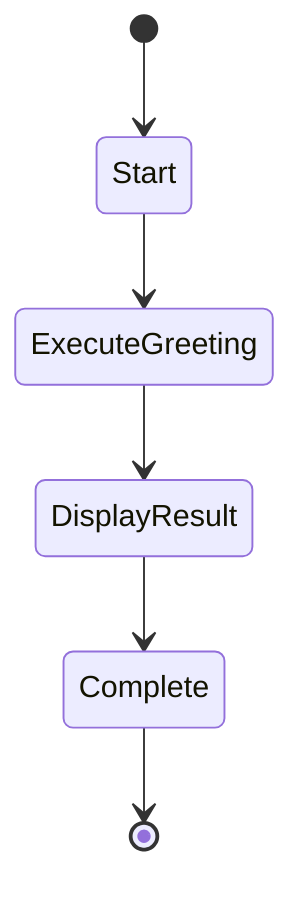

# Say Hello Workflow

This workflow demonstrates executing prompts and streaming their output. It runs the say-hello prompt which provides a friendly greeting and introduction to Swiss Army Hammer workflows.



## Actions

- **Start**: Log "Starting say-hello workflow..."
- **ExecuteGreeting**: Execute prompt "say-hello" with result="greeting_message"
- **DisplayResult**: Log "Greeting completed. The message was streamed to output."
- **Complete**: Log "Say-hello workflow finished successfully!"

## Description

This workflow demonstrates:
- Executing a prompt from within a workflow
- Streaming prompt output in real-time
- Storing prompt results in workflow variables
- Basic workflow lifecycle with clear start and end states

## Usage

To run this workflow:
```bash
swissarmyhammer flow run say-hello
```

The workflow will:
1. Start and log the beginning of execution
2. Execute the say-hello prompt, streaming its output
3. Confirm completion of the greeting
4. Finish with a success message